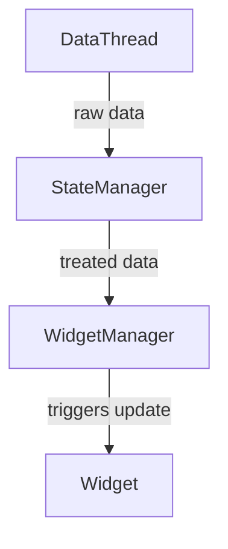

# War Thunder Dashboard for Aircraft

## Try it live!

There is fully-featured version you can try at https://lucasikuhara.github.io/war-thunder-dashboard/

## Summary

The dashboard has a set of graphs, indicators and custom visualizations for the aircraft in the free-to-play game War Thunder. The application is built upon an API provided and hosted by the game itself, that runs at http://localhost:8111.

## Design

### DataThread

Responsible for extracting data from the local telemetry server. Can be subscribed to, allowing for multiple callbacks. Each callback receives the most recent data from an endpoint with an event type corresponding to it.

### StateManager

Keeps the current, and only the current, state for the vehicle and the map in a coherent and practical manner. Should provide a method for consuming the data, and allow for callback registration triggered on update.

## Features

## How to run
