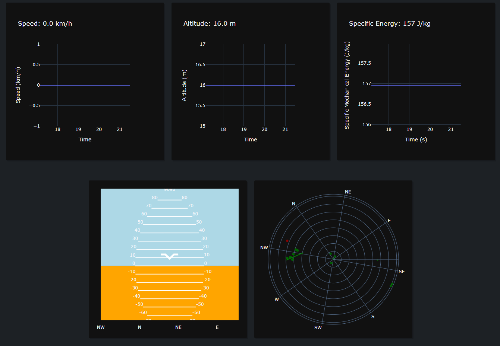

# War Thunder Dashboard for Aircraft

## Try it live!

There is web-based version available at https://lucasikuhara.github.io/war-thunder-dashboard/

## Motivations

This dashboard is a project intended to sharpen my Plotly and FastAPI skills, while 
hopefully having some fun in the process. I have also tried to stick to good practices, specially regarding SOLID principles, aiming to implement things as cleanly as possible. The only noteworthy exception to this is the template HTML files, in which all of the frontend logic is implemented. As this is intended to be a Python project, not a lot of emphasis was given to the VueJs implementations, so I tried to keep it as simple as possible.

## Summary

The dashboard has a set of graphs, indicators and custom visualizations for the aircraft in the free-to-play game War Thunder. The application is built upon an API provided and hosted by the game itself, that runs at http://localhost:8111.

## Features



## How to run

This application has a Dockerfile setup to make it easier to run, but it can also be run in any machine with Python 3.10 or above, although there are some extra steps involved.

### Running with Docker Desktop on Windows or Mac (recommend)

To run the application using the remote image, simply run:

```shell
docker run -p 8000:8000 lucasikuhara/wt-client
```

If you want to build locally instead, assuming that you have already cloned the repository and have the
source code in your machine, you can run the following from inside the directory to which the repository was cloned to:

```shell
docker build --tag my-wt-dashboard .
docker run -p 8000:8000 my-wt-dashboard
```

Note: if running using standard Docker in Windows or Mac, add '--add-host host.docker.internal:host-gateway'
to your run commands. It should look like the following example:

```shell
docker run -p 8000:8000 --add-host host.docker.internal:host-gateway my-wt-dashboard
```

### Running without Docker

Assuming you already have the source code in your machine, as well as Python 3.10 (or above) and pip installed, start by installing the dependencies:

```shell
pip3 install -r requirements.txt
```

To run the application, run:

```shell
cd src/
python3 -m uvicorn app:app
```

### Accessing the Client

As discussed, the client-side application is web-based, and can be accessed using the following URL, once you have the application and the game running: http://localhost:8000/static/aircraft.html
